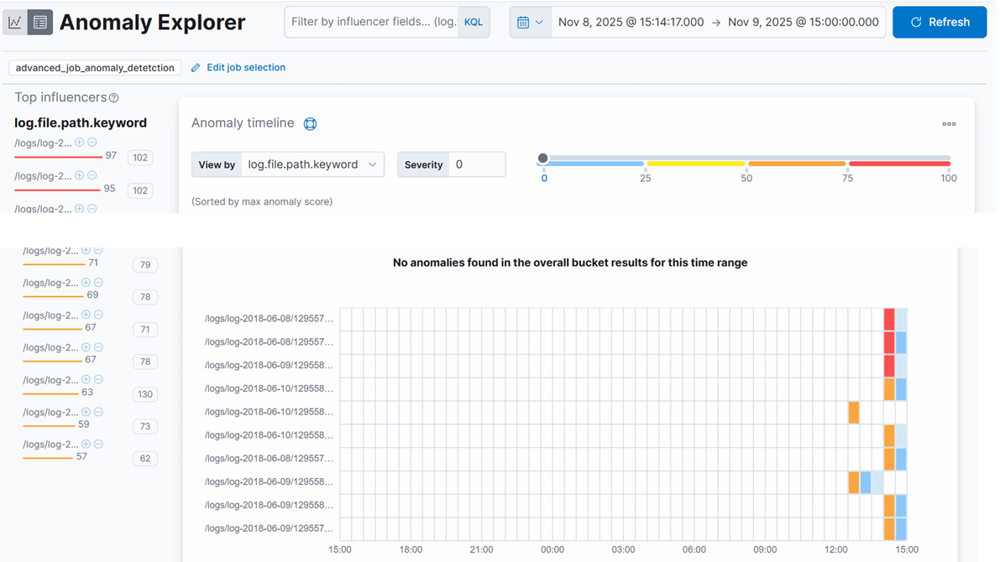
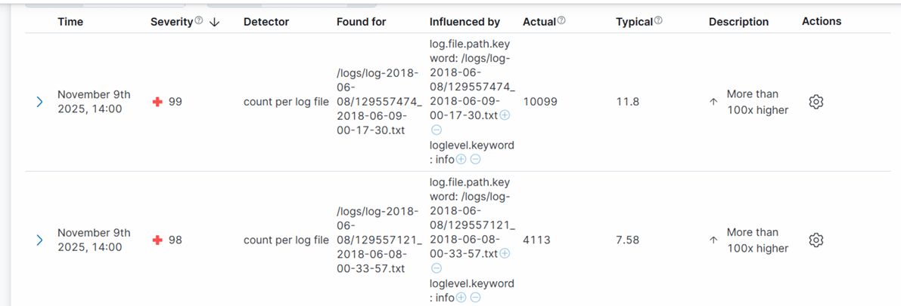

# 🔍 Surveillance et Analyse en Temps Réel des Logs Firefox avec ELK Stack

[](https://www.elastic.co/)
[](https://www.docker.com/)
[](https://www.python.org/)


> Projet académique réalisé dans le cadre du module **Information Retrieval** à l'ENSIAS (2024-2025)

## 📖 À propos

Ce projet implémente une solution complète de **monitoring en temps réel** des logs de build du navigateur Firefox en utilisant la pile ELK (Elasticsearch, Logstash, Kibana). Il intègre également un module de **détection d'anomalies** basé sur le Machine Learning d'Elasticsearch.

### 🎯 Objectifs

- ✅ Centraliser et indexer les logs de build Firefox
- ✅ Automatiser l'ingestion et le parsing des logs hétérogènes
- ✅ Créer des dashboards interactifs pour le suivi temps réel
- ✅ Détecter automatiquement les comportements anormaux via ML
- ✅ Réduire le temps de diagnostic des problèmes de build

---

## 🏗️ Architecture


## 📊 Fonctionnalités Principales

### 1. Pipeline d'Ingestion Automatisé

- Surveillance continue des fichiers `.txt` via Filebeat
- Parsing multi-pattern avec GROK pour gérer l'hétérogénéité des logs
- Reconstruction des timestamps à partir des noms de fichiers
- Normalisation et conversion des types de données
- Enrichissement avec tags conditionnels

### 2. Tableau de Bord Kibana

Le dashboard fournit une vue complète sur :

- 📈 Volume total de logs indexés
- 🎯 Répartition des statuts de build (success, failure, cancelled)
- ⏱️ Évolution temporelle du flux de logs
- 📁 Fichiers les plus actifs
- ⚠️ Distribution des niveaux de log (info, warning, error, fatal)
- 🔥 Taux d'erreurs dans le temps
- ⏳ Durée moyenne des étapes de compilation

### 3. Détection d'Anomalies (Machine Learning)



**Méthode** : Apprentissage non supervisé basé sur la densité probabiliste

**Métrique surveillée** : `count(messages)` par fichier / 15 minutes

**Résultats** :
- Détection de pics anormaux (104× la valeur normale)
- Identification de boucles d'erreurs silencieuses
- Score d'anomalie de 0 à 100



**Cas d'usage détectés** :
- Avalanche d'avertissements (10,099 vs 11.8 messages typiques)
- Échecs répétés de dépendances
- Relances de tâches échouées
- Severity maximale : **99/100**
---

## 📁 Structure des Données

### Format des Logs

Les logs Firefox suivent plusieurs patterns :

```
# Pattern 1 : Étapes de build
2018-06-08T10:30:15.123Z - step start - buildername: linux64-debug

# Pattern 2 : Résultats
results: success (exit code: 0)

# Pattern 3 : Messages d'erreur
ERROR: Failed to download artifact (exit code: 1)
```

### Mapping Elasticsearch

Champs principaux indexés :

| Champ | Type | Description |
|-------|------|-------------|
| `@timestamp` | date | Timestamp reconstruit |
| `log.file.path` | keyword | Chemin du fichier source |
| `loglevel` | keyword | Niveau de log (info, warning, error) |
| `results_text` | keyword | Statut du build |
| `exit_code` | integer | Code de sortie |
| `step_elapsed_secs` | float | Durée de l'étape |

---

## 🎓 Résultats et Métriques

### Performance du Système

- **Volume traité** : 739,218 lignes de logs
- **Taux de parsing** : ~95% des lignes reconnues
- **Latence d'ingestion** : <2 secondes
- **Taux de réussite des builds** : 79.5%

### Détection d'Anomalies

- **Logs analysés** : 8.59 millions de lignes
- **Anomalies détectées** : 15+ pics significatifs
- **Score max** : 94/100
- **Précision** : Granularité par fichier

---


## 🔮 Améliorations Futures

- [ ] Intégration d'alertes automatiques (Slack, Email)
- [ ] Analyse sémantique des messages avec NLP (BERT, Word2Vec)
- [ ] Clustering des patterns d'erreurs
- [ ] Prédiction de durée des builds (ML)
- [ ] Export des dashboards en PDF
- [ ] Intégration CI/CD (Jenkins, GitLab CI)

---

<div align="center">

**⭐ Si ce projet vous a été utile, n'hésitez pas à lui donner une étoile ! ⭐**

</div>
